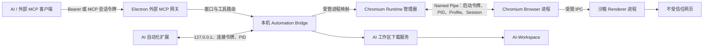

# AI-FREE 自动化浏览器安全性研究

## 基于 Chromium Fork、受认证原生控制通道与最小权限兼容层的工程分析

**文档性质**：工程安全论文 / 安全白皮书  
**软件版本**：AI-FREE `2.6.16`  
**浏览器基线**：Chromium `150.0.7871.114`  
**Chromium 基线提交**：`f405107495a07cb1bfcf687d4af8d91117098db6`  
**评估基准日**：2026-07-23  
**评估范围**：当前仓库源代码、Chromium 补丁队列、MCP 协议、扩展兼容层及现有自动化验收  

> 本文讨论的是当前实现能够提供的安全属性，不构成“绝对安全”、反检测保证或第三方独立审计结论。任何浏览器都仍然受到上游漏洞、操作系统安全状态、供应链、配置和操作者行为的影响。

## 摘要

AI-FREE 是面向 AI 与流程自动化设计的专用浏览器。传统浏览器自动化通常依赖扩展内容脚本、DevTools Protocol 或页面内 JavaScript。这些方案部署简单，但会扩大扩展权限、暴露调试端口或在网页 DOM 中留下可观察修改。AI-FREE 的当前实现把观察、截图、输入、Cookie、Storage、文件选择等主要能力迁移到定制 Chromium Fork，通过 Electron 主进程与 Chromium Browser 进程之间的 Windows Named Pipe 执行，并用一次性启动令牌、PID、Profile ID、协议版本和会话 ID 进行认证。

研究表明，这一架构相较“插件全权控制”显著缩小了默认扩展权限和页面内注入面：正式模式保留 Chromium 沙箱与站点隔离，禁止常见危险启动参数；MCP 不允许创建或运行任意页面脚本；权限自动批准需要精确 Origin 白名单；上传限定在 AI 工作区；软件下载通道具备协议限制、私网阻断、DNS 固定、重定向复检、大小限制和原子落盘；Observe 描边与可见鼠标位于 Chromium Views 层，不进入网页 DOM。

但是，该架构并不意味着网页无法识别自动化，也不能抵御已经取得同一用户权限的恶意本地进程。当前仍保留一个默认关闭的脚本兼容模式，可按用户授权获得 `scripting`、`cookies`、`downloads` 和全站 HTTP/HTTPS 权限；Cookie/Storage 会话导出为本机明文 JSON；本机 HTTP 桥接的扩展注册入口尚未与 Runtime Bridge 的一次性令牌进行强绑定；启动令牌通过进程命令行传递；Chromium 原生下载回退与软件安全下载通道的 SSRF 策略并不完全等价。这些问题构成后续安全加固的主要方向。

综合结论是：**在正式 Fork、脚本兼容模式关闭、外部 MCP 令牌得到妥善保护的条件下，AI-FREE 比插件主导型自动化具有更好的最小权限、页面完整性和控制面隔离；但它仍是一个高权限自动化系统，不应被描述为匿名浏览器、反检测浏览器或安全边界之外的凭据保险箱。**

## 1. 研究问题

本文回答以下问题：

1. 将自动化能力从扩展迁移到 Chromium Fork，是否降低了网页侧检测和扩展失陷风险？
2. AI、扩展、Electron 主进程与 Chromium 之间的控制权限如何建立和约束？
3. Observe、截图、输入、Cookie、Storage、上传和下载分别具有什么安全属性？
4. 当前实现还存在哪些可被利用的攻击面？
5. 在不破坏自动化能力的前提下，下一阶段应优先实施哪些安全改进？

## 2. 研究方法与证据边界

本研究采用基于实现的白盒分析，而不是仅依据产品目标作推断。主要证据包括：

- Chromium 版本锁与可复现补丁队列；
- Electron 主进程的 Chromium 启动、Profile 与 Runtime Bridge 实现；
- 外部 MCP、本机扩展桥接和工具参数规范；
- Observe、截图、原生输入、会话读取、上传和下载实现；
- 单元、契约、集成、打包和真实 Chromium 验收结果；
- Chromium 官方沙箱、站点隔离和 Chrome 扩展权限文档。

本文使用以下置信等级：

| 等级 | 含义 |
|---|---|
| 已验证 | 源码、测试和真实运行验收共同支持 |
| 已实现 | 源码中存在明确控制，但本文未进行独立渗透测试 |
| 设计中 | 技术设计已记录，补丁尚未进入当前队列 |
| 不保证 | 超出本系统安全边界或当前证据不足 |

当前仓库存在持续开发中的未提交修改，因此本文固定到上述基准日和版本。未来代码变更可能使部分结论失效。

## 3. 系统与信任边界

AI-FREE 的主要控制链如下：

安全上需要区分五个边界：

1. **网页边界**：网页和网页脚本始终不受信任。
2. **Renderer 边界**：Renderer 处理不受信任内容，应继续受到 Chromium 沙箱和站点隔离约束。
3. **Browser 进程边界**：Browser 进程可访问 Cookie、截图 Surface 和输入路由，是高权限可信计算基。
4. **Electron 主进程边界**：负责 Profile、MCP、下载、文件系统和进程生命周期，同样属于高权限可信计算基。
5. **本地 AI/MCP 边界**：持有有效令牌的 AI 客户端被授权执行高影响操作，但不应因此自动获得任意文件系统或任意脚本执行权。

## 4. 保护资产

系统需要保护的主要资产如下：

| 资产 | 典型风险 |
|---|---|
| Cookie、Local Storage、Session Storage | 账号接管、会话重放、隐私泄露 |
| Chromium Profile | 跨账号污染、指纹关联、历史与凭据泄露 |
| AI 工作区文件 | 路径越界、覆盖、恶意文件落盘与上传 |
| 浏览器控制权 | 未授权点击、输入、导航、下载或上传 |
| MCP 令牌与 Runtime 启动令牌 | 本地控制通道劫持 |
| 页面完整性 | 注入元素、破坏页面布局、影响业务逻辑 |
| 操作者感知 | 自动化在不可见状态下执行危险动作 |
| 软件供应链 | 被篡改的 Chromium、扩展或补丁进入发行包 |

## 5. 威胁模型

### 5.1 纳入模型的攻击者

- 恶意或已被入侵的网站；
- 恶意下载服务器与重定向目标；
- 提供不可信自动化卡片、会话文件或下载链接的人；
- 未持有有效 MCP 令牌的本机普通进程；
- 被网页漏洞攻陷的 Renderer；
- 获得扩展上下文执行能力的恶意代码；
- 错误配置或能力过大的 AI 调用方。

### 5.2 不作为当前保证的攻击者

- 已取得管理员、内核或当前用户完整控制权的恶意软件；
- 能读取任意同用户进程命令行、内存和文件的本地攻击者；
- 被恶意替换的 AI-FREE 主程序或 Chromium 二进制；
- 未修复的 Chromium、V8、Electron 或操作系统零日漏洞；
- 通过社会工程诱导用户主动授予权限或泄露会话文件的攻击者；
- 远程网站基于行为、指纹或业务规则判断“疑似自动化”。

这一边界非常重要：AI-FREE 的目标是降低自动化控制面的不必要暴露，而不是在操作系统已失陷后保护浏览器秘密。

## 6. 核心安全机制

### 6.1 保留 Chromium 沙箱与站点隔离

正式启动器明确拒绝：

- `--no-sandbox`
- `--single-process`
- `--disable-web-security`
- `--disable-site-isolation-trials`
- `--allow-running-insecure-content`

远程调试地址如果存在，也只能绑定 `127.0.0.1`、`localhost` 或 `::1`。正式模式只接受随软件发布的 `resources/chromium/ai-free-browser.exe`，不会静默回退到系统 Chrome、Edge 或调用方指定的外部浏览器。

这意味着自动化能力没有通过关闭 Chromium 的基础安全模型来换取便利。Windows Chromium 沙箱仍使用受限令牌、Job、完整性级别和 AppContainer 等机制降低 Renderer 或服务进程被攻陷后的权限；站点隔离继续限制被攻陷 Renderer 获取其他站点数据的能力。

**评价：已验证，安全收益高。**

### 6.2 Runtime Bridge 认证

每个受管 Profile 创建独立 Named Pipe，Pipe 名称包含 Electron PID、规范化 Profile ID 和随机后缀。启动时生成 32 字节随机令牌。Chromium 的首帧必须同时匹配：

- 消息类型 `hello`；
- 协议版本；
- Profile ID；
- 一次性启动令牌；
- 预期 Chromium PID。

握手成功后，启动令牌立即从 Electron 内存字段中清空，并生成新的 Session ID。后续每条消息必须匹配协议版本、Profile ID 和 Session ID。协议采用长度前缀帧，并将单帧限制为 4 MiB；命令还需命中固定白名单。

该设计阻止其他 Profile、旧会话和随机本机客户端直接向 Browser 进程发送自动化指令，也避免创建第二套无认证 Native Host。

**剩余限制**：启动令牌当前作为 Chromium 命令行参数传递。同用户高权限进程可能在短暂握手窗口内读取进程命令行；Node 创建 Named Pipe 时也未在应用层显式声明仅限当前用户 SID 的 DACL。PID 匹配是重要的绑定条件，但不能代替操作系统对象 ACL。

**评价：已实现，认证设计较强，但本地同用户攻击面仍需收紧。**

### 6.3 外部 MCP 网关

外部 MCP 网关只绑定本机 Automation Bridge，并使用 32 字节随机令牌。令牌通过专用请求头或 Bearer 认证，比较过程使用恒定时间比较；请求体限制为 1 MiB；响应设置 `Cache-Control: no-store`。描述文件采用临时文件加原子重命名发布，退出时按 PID 删除。

网关还执行：

- 在线会员权限检查；
- 工具白名单与浏览器窗口路由；
- 多窗口歧义时拒绝隐式选择；
- 从外部参数中剥离浏览器路由和远端上传字段；
- 禁止外部 MCP 通过 `save_cookies` 上传 Cookie 原文。

需要注意，会员校验是产品授权机制，不应被当作密码学安全边界。真正的控制面认证仍由 MCP 随机令牌承担。

**评价：已实现。**

### 6.4 本机扩展桥接

扩展桥接监听 `127.0.0.1`，拒绝带有非浏览器扩展 Origin 的请求。注册成功后生成独立 32 字节连接令牌；后续请求同时校验连接 ID、令牌和浏览器 PID，并使用 3 秒心跳 TTL 清理离线连接。

但是，`POST /v1/register` 是公开注册入口；请求如果不携带 `Origin` 不会被 Origin 规则拒绝，PID 请求头也可由普通 HTTP 客户端伪造。注册阶段尚未强制验证该 PID 确属受管 Chromium，也没有使用 Runtime Bridge 会话作挑战证明。攻击者仍需处于本机并猜测或获知受管 PID，但该门槛低于 Runtime Bridge 本身。

**评价：存在中等优先级本地控制面风险。**

### 6.5 Profile 隔离与生命周期

系统采用“一 Chromium 进程对应一个受管 Profile”的模型，使用独立用户数据目录、Profile ID、进程锁和运行实例映射。自动化请求根据真实子进程 PID 反查 Profile；不属于当前受管实例的 PID 会被拒绝。Profile 锁避免同一 Profile 被并发进程复用，退出和故障路径负责释放连接、定时器与待处理任务。

这一机制主要防止误路由和跨账号污染，不等同于操作系统级多用户隔离。同一 Windows 用户仍可能直接读取其有权访问的 Profile 文件。

**评价：已验证。**

## 7. 自动化能力的逐项安全分析

### 7.1 Observe 与元素标识

当前原生 Observe 通过受认证 Runtime Bridge 调用，在 Chromium 隔离世界中读取可见页面结构，返回有限数量的元素、文本、坐标、选择器和下载链接。输入参数具有长度和数量上限，Observe 默认最多返回 200 项，运行时硬限制为 1–1000 项。

元素边框位于 Chromium Views 层：

- 不创建网页 DOM 节点；
- 不修改网页 CSS；
- 不参与页面命中测试；
- 最多绘制 120 个标记；
- 导航、滚动、窗口隐藏或超时后清除。

因此，网页无法通过查询 DOM 直接发现边框，也不会因为覆盖层截获点击而改变业务行为。

**限制**：元素发现仍执行隔离世界 JavaScript，并非完全基于 Browser 进程 AXTree。隔离世界能降低与页面 JavaScript 的命名空间冲突，却不能提供“网页绝对无法推断自动化”的证明；高频 DOM 遍历仍可能产生可测量的时序影响。

### 7.2 截图

原生截图从 RenderWidget Surface 获取，不依赖 `chrome.debugger`，也不需要在页面插入截图代码。区域、元素和全页参数均有限制，当前只接受 PNG。

Chromium Views 层的 Observe 边框不属于页面 Surface，因此默认不会被写入网页截图。这种分离避免把辅助标识污染到页面证据中，但需要调用方理解“屏幕上可见”与“页面截图可见”不是同一概念。

### 7.3 鼠标、键盘与滚轮

点击使用 Chromium Views 可见指针和 RenderWidgetHost 输入路径。覆盖层不移动 Windows 全局鼠标、不接收点击；指针采用固定缓动轨迹、按下/抬起和双击间隔。滚轮通过 `WebMouseWheelEvent`，文本和常用按键通过 Chromium 原生键盘事件分发。

安全收益包括：

- 不依赖页面调用 `element.click()`；
- 不在 DOM 中绘制伪鼠标；
- 不控制用户的系统级指针；
- 标签页或窗口销毁时取消未完成动作；
- AI 与用户能看到自动化正在操作的大致位置。

但是，“可信输入事件”只描述 Chromium 的事件生成路径，不代表网站一定把它视为真人操作。固定轨迹、节奏、页面行为和账号环境仍可能被风控系统识别。系统没有加入随机抖动或绕过检测逻辑，也不应加入以规避网站安全控制为目的的机制。

### 7.4 Cookie 与 Storage

Cookie 由 Browser 进程 CookieManager 读取，因此可包含 JavaScript 无法访问的 HttpOnly Cookie；Local Storage 和 Session Storage 在当前页面 Origin 的隔离世界中读取。会话导入执行以下约束：

- 只接受无内嵌凭据的 HTTP/HTTPS URL；
- Cookie URL、Domain 与目标主机必须相关；
- Storage Origin 必须是纯 Origin 且与目标主机相关；
- Cookie、Origin、Storage key 和总字节数均有上限；
- 跨域条目会被跳过或拒绝；
- Browser 进程再次执行 Cookie 规范校验。

这是强能力，也是系统中最敏感的能力之一。通过 Browser 进程读取 HttpOnly Cookie 会绕过“网页 JavaScript 不可读”的限制，但没有绕过浏览器控制者本来就拥有的 Profile 管理权限。安全性取决于谁能够调用 MCP、会话数据写到哪里，以及保存文件是否被妥善保护。

当前 `save_session` 把 Cookie 和 Storage 写为 AI 工作区中的 JSON。写入使用临时文件、排他创建、原子提交和尽力设置 `0600` 模式，但在 Windows 上 POSIX mode 不能替代精确 NTFS ACL，文件内容也未加密。

**评价：域约束较强，静态数据保护不足。**

### 7.5 文件上传

上传只接受 1–32 个绝对路径，调用前验证文件或目录真实存在、类型与上传模式匹配，并要求路径位于 AI 工作区。请求绑定当前页面 HTTP/HTTPS Origin，具备 1–120 秒 TTL，并以一次性队列交给 Chromium 文件选择器消费。Chromium 侧再次比较当前 Origin 和选择器模式。

该设计优于通用 `--default-file-path`：本地路径不会长期暴露在浏览器启动参数中，也不会在页面不匹配时被无条件使用。

**剩余限制**：Bridge 响应只表示请求已安全入队，不代表网页已完成消费；调用方必须依据后续页面状态判断结果。对工作区内由其他本机进程并发替换的文件，当前没有基于文件句柄或哈希的最终消费绑定。

### 7.6 AI 专用下载服务

软件下载通道默认把文件写入 `AI-Workspace`，目录和文件名均按相对路径解析。主要控制包括：

- 仅允许 HTTP/HTTPS；
- URL 禁止用户名和密码；
- 阻断 localhost、`.localhost`、`.local`、私网、链路本地、保留和不可路由地址；
- 下载前解析全部地址，并把请求 DNS lookup 固定到已经检查的公网地址，降低 DNS rebinding 风险；
- 每次重定向重新规范化 URL、解析并检查地址，最多 5 次；
- Cookie 只按 Domain、Path、Secure 和有效期重新匹配目标 URL；
- Header 过滤 CR/LF 与长度；
- 默认 250 MiB、最大 1 GiB、最长 300 秒；
- 流式计算 SHA-256；
- 临时 `.part` 文件成功后原子提交，失败时清理；
- 路径规范化、真实路径复检和文件名净化防止目录穿越。

这是当前实现中防御较完整的一条数据入口。

但工具还允许 Chromium 原生下载作为媒体下载或失败回退。原生下载遵循 Chromium 正常网络和下载安全策略，却不复用软件通道的“禁止私网、固定 DNS、逐跳 SSRF 检查”。因此：

- 对公网不可信链接，软件通道具有更清晰的服务端下载边界；
- 对需要浏览器会话或站内媒体的链接，Chromium 原生通道兼容性更好；
- 两者不能被宣称拥有完全相同的 SSRF 安全属性；
- 显式 `transport=browser` 或自动回退可能访问当前机器本来可访问的内网资源。

## 8. 扩展兼容层与脚本注入风险

### 8.1 自动化权限边界

浏览器自动化扩展已删除。软件不再申请 `activeTab`、`scripting`、`cookies`、`downloads` 或全站 Host 扩展权限，也不接受扩展通过 loopback `/v1/register` 注册。页面观察、点击、输入、截图、标签管理、文件选择和当前站点数据清理全部通过 Profile 绑定的 Chromium Runtime Bridge 完成。

Runtime 命令仍受 Named Pipe 握手、一次性令牌、Profile ID、受管进程和固定命令白名单约束。文件上传额外绑定当前 HTTP(S) Origin；站点数据清理调用 `ClearDataForOrigin`，不会清空其它 Profile 或其它站点。

### 8.2 任意脚本执行已移除

软件卡片 schema 只接受固定步骤类型。保存、导入、局部编辑和运行均拒绝 `external_script`、`condition_mode=js` 以及任何 `script` 字段。软件端不再包含脚本兼容开关、`new Function` 路径或自动化内容脚本。

自动保存会话仍是受控卡片步骤；它把当前 Runtime 返回的 Cookie/Storage 保存到 AI 工作区，不提供手动查看、编辑、导入、导出或逐项删除 Cookie 的界面。

## 9. 权限自动批准

AI-FREE 的权限自动批准不是全局放行。它必须同时满足：

- `--hs-embed-mode=child-window`；
- 显式启用权限自动批准；
- 非空且有效的 Origin 白名单；
- 请求 Origin 与顶层页面 Origin 均精确命中白名单；
- HTTPS，或开发场景下的 HTTP loopback；
- Chromium 原有安全上下文、Permissions Policy 和 Frame 状态校验继续通过；
- 权限类型属于实现中的允许子集。

白名单拒绝通配符、用户名密码、非根路径、查询和 Fragment。未命中时回到 Chromium 默认权限流程，而不是静默批准或静默拒绝。

该设计避免了“为了自动化直接允许所有网站摄像头、定位和剪贴板”的常见错误。其主要风险在于配置：如果操作者把大量敏感站点加入白名单，或自动化页面本身被接管，站点仍可在已授权范围内请求能力。

**评价：已实现，默认安全，配置敏感。**

## 10. 未实施设计与不可混淆的状态

当前补丁队列已经实现 `0014`、`0015` 和 `0020`–`0024`。以下设计仍未实施：

| 补丁 | 设计目标 | 当前状态 |
|---|---|---|
| `0016` | Chromium Profile 级静默下载目录 | 设计中 |
| `0017` | 有 Origin 限制的 JS 原生对话框处理 | 设计中 |
| `0018` | 通知与逐项非安全提示抑制 | 设计中 |
| `0019` | Popup 与新标签页路由 | 设计中 |

当前存在的 AI 工作区下载服务不等于 `0016` 的 Chromium Profile 级动态下载目录补丁；两者属于不同层。本文不会把尚未进入补丁队列的功能计入安全结论。

## 11. 风险评估

| 编号 | 风险 | 可能性 | 影响 | 等级 | 当前缓解 |
|---|---|---:|---:|---:|---|
| R1 | 本机客户端伪造扩展注册并取得 Bridge 连接令牌 | 中 | 高 | 高 | 回环绑定、后续连接令牌与 PID；注册尚未强绑定 Runtime 会话 |
| R2 | 会话 JSON 被同用户其他进程读取 | 中 | 高 | 高 | 工作区限制、原子写入；未加密，Windows ACL 未精确收紧 |
| R3 | 开启脚本兼容模式后扩展或不可信卡片执行页面脚本 | 中 | 高 | 高 | 默认关闭、可选权限、MCP 拒绝任意 JS |
| R4 | Runtime 启动令牌被同用户进程从命令行窃取 | 低至中 | 高 | 中高 | 高熵、一次性、PID/Profile 绑定、短握手窗口 |
| R5 | Chromium 原生下载回退访问内网资源 | 中 | 中高 | 中高 | 需要已授权工具调用；软件通道本身具备 SSRF 防护 |
| R6 | Cookie/Storage 工具被合法但过度授权的 AI 滥用 | 中 | 高 | 高 | MCP 令牌、工具白名单、禁止远端上传字段；缺少逐次用户确认 |
| R7 | DOM 隔离世界观察产生可测量行为特征 | 低至中 | 低至中 | 中低 | 不修改 DOM、限量、超时清理 |
| R8 | 自动化输入被网站风控识别 | 高 | 业务相关 | 非安全漏洞 | 未承诺反检测，固定原生事件路径 |
| R9 | 上游 Chromium 或 Electron 漏洞 | 持续存在 | 高 | 高 | 版本锁、沙箱、站点隔离；依赖持续更新 |
| R10 | 补丁或运行时供应链被篡改 | 低至中 | 严重 | 高 | Chromium commit 和部分资产 SHA-256 锁定；尚需完整签名与 SBOM |

## 12. 与插件主导型自动化的比较

| 维度 | 插件主导型方案 | 当前 AI-FREE Fork 方案 |
|---|---|---|
| 默认页面权限 | 常需全站 Host 与 scripting | 原生通道优先；广域权限默认关闭 |
| 页面 DOM 修改 | 常见 | Observe 标记和鼠标不进入 DOM |
| HttpOnly Cookie | 依赖 cookies 权限 | Browser 进程 CookieManager 可读 |
| 输入 | DOM API 或脚本事件 | RenderWidgetHost 原生事件路径 |
| 调试接口 | 可能暴露 CDP 端口 | 正式路径不依赖 CDP |
| 文件上传 | 扩展或系统对话框模拟 | Origin + TTL + 工作区 + 一次性选择 |
| 下载 | 浏览器扩展 API | 软件安全下载为主，Chromium 可回退 |
| 失陷影响 | 扩展权限决定，可能全站 | Browser/Electron 控制面更集中，认证要求更高，但一旦失陷影响仍大 |
| 网页侧可见性 | 注入痕迹较多 | DOM 痕迹更少，但不能保证不可检测 |
| 更新成本 | 较低 | Fork 补丁维护和安全更新成本更高 |

Fork 的主要优势不是“更像真人”，而是把高权限自动化决策移到更适合实施认证、Profile 绑定和浏览器策略校验的 Browser 进程。代价是可信计算基变大：自定义 C++、Electron 主进程和补丁供应链都必须接受持续审计。

## 13. 建议的安全加固路线

### 13.1 P0：发布前优先项

1. **保持扩展注册入口关闭**
   loopback Bridge 不得重新开放 `/v1/register`、poll、heartbeat 或调用方提交工具定义；浏览器连接只能由受管 Chromium Runtime 状态生成。

2. **保护会话导出文件**
   默认使用 Windows DPAPI 按当前用户加密 Cookie/Storage；如需可移植明文导出，应明确二次确认并显示风险。为会话目录设置当前用户专用 NTFS ACL，并支持自动过期清理。

3. **保持固定卡片步骤白名单**
   不重新引入脚本兼容模式；不可信导入卡片在任何入口都不得包含任意脚本或 JS 条件。

4. **统一敏感操作授权**
   Cookie/Storage 导出、批量上传、覆盖下载和权限自动批准应支持按站点策略与可选的用户确认，而不是仅依赖“客户端持有 MCP 令牌”。

### 13.2 P1：近期加固

1. 为 Named Pipe 设置当前用户 SID 专用 DACL，并核验客户端 PID；
2. 将启动令牌从命令行迁移到继承句柄、预认证 Pipe 或其他不暴露于进程列表的启动秘密传递方式；
3. 让 Chromium 原生下载回退明确区分“允许访问内网”策略，默认对 AI 提供的公网 URL 使用软件安全下载；
4. 对下载目标目录使用更强的句柄级防重解析点检查，降低 Junction/Symlink 竞态；
5. 对 MCP 调用建立脱敏审计日志，记录工具、窗口、Origin、结果和调用方会话，但永不记录 Cookie、Authorization 或输入密码；
6. 对外部 MCP 描述文件在 Windows 上使用显式 ACL，而不只依赖 `chmod(0600)`。

### 13.3 P2：中长期建设

1. 将元素发现逐步迁移到 Browser 可控的 Accessibility Tree 或受限 Renderer IPC，减少通用脚本解释面；
2. 建立 Chromium 上游安全更新 SLA，避免长期停留在固定旧版本；
3. 对补丁、扩展、Chromium 运行时和安装包生成 SBOM、完整文件清单与签名；
4. 对 Runtime Bridge 帧解析、会话导入、URL 重定向和卡片解析进行覆盖引导模糊测试；
5. 增加本地恶意客户端、DNS rebinding、重解析点和跨 Profile 越权的专项渗透测试；
6. 为敏感工具定义机器可读的风险标签，例如 `read_credentials`、`write_files`、`upload_files` 和 `grant_permissions`，供 AI 调用策略使用。

## 14. 可验证的安全不变量

建议把下列条件长期固化为自动化门禁：

1. 正式模式无法使用系统 Chrome、Edge 或任意外部路径；
2. 危险 Chromium 开关始终被启动器拒绝；
3. 未完成 Runtime 握手时任何原生命令均失败；
4. 旧 Session ID、错误 PID、错误 Profile ID 和超限帧均被拒绝；
5. MCP 卡片无法包含 `external_script` 或 JS 条件；
6. 脚本兼容模式默认关闭，关闭后可选权限确实撤销；
7. Observe 不向页面 DOM 插入节点、属性或样式；
8. 文件上传无法离开 AI 工作区，且 Origin 不匹配时 Chromium 不消费；
9. 软件下载的每次重定向都重新执行私网地址检查；
10. 下载失败、超时和超限后不遗留 `.part` 文件；
11. 会话导入不能跨无关主机写入 Cookie 或 Storage；
12. 日志、错误和测试 Fixture 不包含真实 Cookie、MCP Token 或 Authorization。

## 15. 结论

AI-FREE 当前安全架构的关键价值，是把自动化从“一个拥有全站权限、可任意注入脚本的扩展”转变为“由受管 Electron 主进程授权、经一次性认证通道进入 Chromium Browser 进程的有限命令集合”。这一变化改善了默认最小权限、Profile 绑定、页面完整性、输入可见性和文件系统约束。

就本文证据而言，可以作出三个结论：

1. **相较插件全权控制，Fork 原生通道在默认配置下更安全。**  
   它减少了广域扩展权限、DOM 修改和公开调试接口，并保留 Chromium 沙箱及站点隔离。

2. **“更安全”不等于“不可检测”或“不会泄露凭据”。**  
   自动化行为仍可能被网站风控识别；Cookie/Storage 是高敏感能力；明文会话文件和本地桥接认证仍需加固。

3. **系统的实际安全等级取决于运行模式。**  
   正式 Fork + 脚本兼容关闭 + 受保护 MCP 令牌是推荐基线。开启广域扩展权限、执行不可信卡片或允许原生下载访问内网，会显著扩大风险。

因此，AI-FREE 可以被合理描述为“采用原生受认证控制面和默认最小权限设计的自动化专用浏览器”，但不应被描述为“绝对安全浏览器”“无法检测的浏览器”或“能抵御本机恶意软件的凭据保险箱”。完成 P0 加固后，其控制面安全性和敏感数据保护将更接近可对外审计和企业部署的要求。

## 参考资料与实现证据

### 项目内证据

1. [Chromium Fork 版本锁与构建说明](../native/chromium-fork/README.md)
2. [Chromium 自动化增强技术设计](chromium-150-automation-enhancement-design.md)
3. [MCP 工具与安全约束](mcp.md)
4. [Chromium 启动安全策略](../src/app/main/browser-runtime/chromium-launcher.js)
5. [Runtime Bridge 客户端与握手](../src/app/main/browser-runtime/chromium-command-client.js)
6. [原生自动化参数规范](../src/app/main/browser-runtime/runtime-automation.js)
7. [文件选择工作区与 Origin 校验](../src/app/main/browser-runtime/runtime-file-selection.js)
8. [会话导入限制](../src/app/main/browser-runtime/session-import.js)
9. [本机 Automation Bridge](../src/app/main/services/browser-automation-bridge.js)
10. [外部 MCP 网关](../src/app/main/services/browser-automation-external-gateway.js)
11. [AI 下载服务](../src/app/main/services/browser-download-service.js)
12. [下载网络与 SSRF 策略](../src/app/main/services/browser-download-network-policy.js)
13. [原生浏览器工具定义](../src/app/main/features/browser-automation/native-tool-definitions.js)
14. [原生卡片执行器](../src/app/main/features/browser-automation/native-card-runner.js)
15. [Chromium 补丁队列](../native/chromium-fork/patches/series)

### 外部基础资料

16. Chromium Project, [Sandbox Design](https://chromium.googlesource.com/chromium/src/+/main/docs/design/sandbox.md)
17. Chromium Project, [Process Model and Site Isolation](https://chromium.googlesource.com/chromium/src/+/main/docs/process_model_and_site_isolation.md)
18. Chrome for Developers, [Declare permissions](https://developer.chrome.com/docs/extensions/develop/concepts/declare-permissions)
