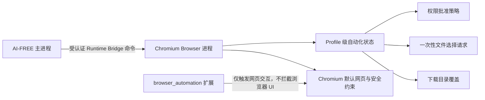

# AI-FREE Chromium 150 自动化增强技术设计

**文档版本**：2.0  
**基线日期**：2026-07-22  
**目标版本**：Chromium `150.0.7871.114`  
**基线提交**：`f405107495a07cb1bfcf687d4af8d91117098db6`  
**状态**：`0014` 权限策略、`0015` 文件选择、`0020` 页面自动化原生通道、`0021` 可见原生指针、`0022` 下载链接观察与 `0023` 原生键盘/滚轮已实现；`0016`–`0019` 待实施

## 1. 目标与边界

本设计用于 AI-FREE 嵌入式 Chromium Fork，目标是在不依赖扩展注入、不修改网页 DOM、不模拟系统对话框点击的前提下，稳定完成权限请求、文件上传、下载、JavaScript 对话框及常见浏览器提示的自动化处理。

核心原则如下：

1. 自研扩展不得主动拦截权限、文件选择、下载、`alert`、`confirm`、`prompt` 或其他浏览器对话框。
2. 自定义自动化行为必须由 Chromium Browser 进程和 Runtime Bridge 实现。
3. 所有 AI-FREE 自动化覆盖都以 `--hs-embed-mode` 为硬门槛；普通启动模式保持 Chromium 默认行为。
4. 权限自动批准必须同时启用权限开关并命中非空 origin 白名单。未命中时回落 Chromium 默认权限流程，不自动拒绝。
5. 不绕过安全上下文、Permissions Policy、企业策略、系统级摄像头/麦克风权限或设备选择流程。
6. 文件和下载路径必须由受认证的 Runtime Bridge 或受控启动配置提供，并经过路径校验。
7. 安全警告绕过只允许在显式开发模式启用，不作为生产自动化默认能力。

## 2. 已有架构与适用范围

AI-FREE 当前以“一 Chromium 进程对应一个受管 Profile”的方式启动 Fork，并传入：

```text
--hs-embed-mode=child-window
--hs-embed-parent-hwnd=<HWND>
--hs-profile-id=<profile-id>
--hs-runtime-pipe=<named-pipe>
--hs-runtime-token=<one-time-token>
```

Runtime Bridge 使用 Windows Named Pipe、一次性启动令牌、PID、Profile ID、协议版本和 Session ID 完成认证。新增的文件选择和下载目录命令必须复用该通道，不建立第二套 Native Host 或未认证 IPC。



## 3. 生效门槛

### 3.1 统一硬门槛

所有新增自定义行为先检查：

```text
IsAiFreeEmbeddedMode = command_line.HasSwitch("hs-embed-mode")
                       && command_line.GetSwitchValueASCII("hs-embed-mode") == "child-window"
```

下列情况一律不启用任何 AI-FREE 自动化覆盖：

- 没有 `--hs-embed-mode`；
- `--hs-embed-mode` 值不是 `child-window`；
- Off-the-Record / Incognito Profile；
- Runtime Bridge 握手未完成，而功能又依赖动态状态；
- 参数无效、路径校验失败或白名单为空。

单独传入 `--auto-grant-permissions`、`--auto-dismiss-js-dialogs` 等开关，不得绕过上述硬门槛。

### 3.2 权限自动批准有效条件

权限自动批准仅在以下条件全部成立时生效：

```text
--hs-embed-mode=child-window
--auto-grant-permissions
--auto-grant-permissions-origins=<非空 origin 列表>
```

AI-FREE 启动器可在嵌入模式下默认追加 `--auto-grant-permissions`，但 Fork 内部仍必须独立校验三项条件。白名单缺失或全部条目无效时，自动批准为关闭状态。

## 4. Origin 白名单规范

### 4.1 参数格式

```text
--auto-grant-permissions-origins=https://example.com,https://studio.example.com:8443
```

规则：

- 使用逗号分隔；解析前去除首尾空白。
- 每项必须是完整 origin：`scheme://host[:port]`。
- 只允许 `https`；开发环境可额外允许 loopback 主机的 `http`。
- 拒绝用户名、密码、非根路径、查询参数和 fragment。
- 使用 `url::Origin::Create(GURL(value))` 规范化默认端口后做精确相等比较。
- 不支持 `*`、通配子域、正则表达式或仅主机名条目。
- 需要多个子域时必须逐项列出，避免白名单意外扩大。

### 4.2 Frame 与嵌入关系

自动批准必须同时满足：

- `PermissionRequest::requesting_origin()` 命中白名单；
- `source_frame->GetOutermostMainFrame()->GetLastCommittedOrigin()` 命中白名单；
- Chromium 原有安全上下文、Permissions Policy、Frame 活跃状态和 fenced frame 校验通过。

跨 origin iframe 只有在请求方和顶层页面都被明确列入白名单，并且 Permissions Policy 允许时才可自动批准。不得使用 AI-FREE 逻辑绕过 embedding-origin 检查。

### 4.3 未命中行为

未命中白名单时返回“无 AI-FREE 决策”，继续执行 Chromium 默认流程。不得返回 `IGNORED`、`DENIED` 或直接取消请求，否则会把正常权限提示错误地变成静默拒绝。

## 5. 公共策略组件

新增一个无 UI、无 Profile 持有关系的公共策略组件，供权限和对话框等不同层使用：

```text
components/ai_free/automation/automation_policy.h
components/ai_free/automation/automation_policy.cc
components/ai_free/automation/automation_switches.h
components/ai_free/automation/automation_switches.cc
```

建议接口职责：

- 判断是否为有效的 AI-FREE 嵌入模式；
- 解析并缓存只读 origin 白名单；
- 判断 requesting origin 与 top-level origin 是否允许；
- 读取 JS 对话框默认值等纯命令行配置；
- 不保存文件路径队列、下载状态或 `Profile*`。

现有 `kHsEmbedMode`、`kHsProfileId`、`kHsRuntimePipe` 等 AI-FREE 自定义开关应逐步迁移到该组件，避免 `components/*` 反向依赖 `chrome/common/chrome_switches.h`。迁移在补丁应用后的最终源码中完成，不改变已有参数名称。

## 6. 权限请求自动批准

### 6.1 Chromium 150 的准确入口

主要调用链：

```text
content/browser/permissions/permission_controller_impl.cc
  -> components/permissions/permission_context_base.cc
  -> components/permissions/permission_request_manager.cc
  -> permissions::PermissionsClient::GetAutoApprovalStatus(...)
  -> chrome/browser/permissions/chrome_permissions_client.cc
```

原清单中的以下路径不适用于 Chromium 150：

```text
chrome/browser/permissions/permission_request_manager.cc
chrome/browser/permissions/permission_prompt.cc
chrome/browser/permissions/permission_controller_impl.cc
chrome/browser/permissions/permission_context_base.cc
```

对应实现已位于 `components/permissions`、`content/browser/permissions`，Chrome embedder 入口为 `ChromePermissionsClient`。

### 6.2 实现方式

不得在 `PermissionControllerImpl` 中无条件伪造 `PermissionStatus::GRANTED`。Chromium 150 已在 `PermissionRequestManager::AddRequest` 中提供自动批准链路，应扩展该链路，使 embedder 能根据完整 `PermissionRequest` 决策：

```text
PermissionsClient::GetAutoApprovalStatusForRequest(
    BrowserContext*, RenderFrameHost*, const PermissionRequest&)
```

默认实现保持现有 kiosk 行为；`ChromePermissionsClient` 覆盖实现并执行：

1. 嵌入模式硬门槛；
2. `--auto-grant-permissions` 检查；
3. requesting origin 与 top-level origin 白名单检查；
4. 权限类型白名单检查；
5. 返回 `PermissionAction::GRANTED_ONCE`；
6. 不符合条件时继续现有 Chrome/kiosk 决策，最终无覆盖则返回 `std::nullopt`。

兼容实现应让新虚函数的基类默认实现调用现有 `GetAutoApprovalStatus(browser_context, request.requesting_origin())`，再把 `PermissionRequestManager::AddRequest` 的调用点切换到新函数。这样 ChromeOS kiosk 和上游测试语义不变，AI-FREE 只在 Chrome embedder 覆盖中增加更严格的 frame、origin 和权限类型判断。

采用 `GRANTED_ONCE` 可避免把自动化授权永久写入 Profile。页面再次请求时仍可根据当前启动参数自动批准。

### 6.3 初始允许类型

第一阶段仅允许下列 `permissions::RequestType`：

| RequestType | 场景 | 说明 |
|---|---|---|
| `kGeolocation` | 定位 | 包括 Chromium 150 的 geolocation options 流程 |
| `kNotifications` | 网站通知权限 | 只批准站点权限；是否展示通知由第 9 节控制 |
| `kClipboard` | 剪贴板读写 | 保留 Chromium 对安全上下文和页面行为的检查 |
| `kMicStream` | 麦克风 | 不绕过 Windows 隐私设置或设备不可用错误 |
| `kCameraStream` | 摄像头 | 不绕过 Windows 隐私设置或设备不可用错误 |
| `kSensors` | 传感器 | 仍受平台能力限制 |

以下类型默认不自动批准：File System Access、USB、Serial、HID、Bluetooth、MIDI SysEx、屏幕/窗口捕获、Protected Media、Local Network、Storage Access、Identity Provider、支付及任何需要用户选择具体设备或文件系统句柄的能力。

File System Access 不应与 HTML `<input type=file>` 混为一谈；后者按第 7 节处理。

### 6.4 日志

只记录：Profile ID、规范化 origin、权限类型、决策来源和结果。不得记录 Runtime token、剪贴板内容、设备 ID 或页面敏感数据。建议使用 `VLOG(1)`，并避免每次状态查询重复刷日志。

### 6.5 补丁

建议补丁：`0014-ai-free-automation-policy-and-permissions.patch`

主要修改点：

```text
components/ai_free/automation/*
components/permissions/permissions_client.h
components/permissions/permissions_client.cc
components/permissions/permission_request_manager.cc
chrome/browser/permissions/chrome_permissions_client.h
chrome/browser/permissions/chrome_permissions_client.cc
相关 BUILD.gn 与测试
```

## 7. 本地文件上传

### 7.1 Chromium 150 的准确入口

HTML 文件输入最终由以下调用链处理：

```text
content/browser/web_contents/file_chooser_impl.cc
  -> content/browser/web_contents/web_contents_impl.cc
  -> chrome/browser/ui/browser.cc
  -> chrome/browser/file_select_helper.cc
  -> ui::SelectFileDialog
```

主要 Hook 应放在 `chrome/browser/file_select_helper.cc` 的 `FileSelectHelper::RunFileChooser`，在创建 `ui::SelectFileDialog` 前消费一次性预选文件。原清单中的 `content/browser/file_system/file_chooser_impl.cc` 和 `chrome/browser/ui/views/select_file_dialog.cc` 在 Chromium 150 中不存在。

### 7.2 状态所有权

`0015` 使用 `content::WebContentsUserData` 实现 `AiFreeFileSelection`，在 UI 线程保存一次性待消费请求。状态绑定触发上传的具体网页标签，而不是 Profile 全局队列，因此同一 Profile 的其他标签页无法误消费文件。请求包含路径、精确 origin、chooser mode 和过期时间；`WebContents` 销毁时状态随之释放。

动态下载目录属于后续 `0016` 的 Profile 级状态，不与文件选择队列共用所有权。不得把待选文件存放在扩展、本地网页、全局静态变量或命令行中。

### 7.3 Runtime Bridge 命令

新增命令：

```json
{
  "type": "select-files",
  "origin": "https://example.com",
  "paths": ["D:\\assets\\input.png"],
  "mode": "open",
  "ttlMs": 30000
}
```

Bridge 公共字段 `protocolVersion`、`profileId`、`sessionId` 和 `requestId` 继续由现有客户端添加。

约束：

- `origin` 必须是规范化后的精确 origin，且当前顶层页面必须匹配；
- `paths` 为 1–32 个绝对 Windows 路径；
- `open` 只接受一个普通文件；`open-multiple` 可接受多个普通文件；
- `upload-folder` 只接受一个目录；第一阶段不自动处理 `save` 模式；
- AI-FREE 主进程在发送命令前异步检查路径存在性和文件/目录类型；Chromium 再复核绝对路径、数量、模式和当前顶层 origin；
- 请求单次消费，默认 30 秒、最大 120 秒；origin 或模式不匹配、标签页关闭或超时后不可消费；
- 同一标签页的新请求覆盖旧请求。协议 v1 不单独发送 superseded 事件。

Bridge 的 `select-files` 响应只表示“已安全入队”，不表示网页已经消费文件。当前协议不回传完整本地路径，也尚未提供独立的 consumed 事件；调用端以随后内核点击成功及网页上传状态为准。

### 7.4 Chooser 消费

`FileSelectHelper::RunFileChooser` 在 Chromium 原有生命周期检查完成后：

1. 获取当前 `WebContents` 的 `AiFreeFileSelection`；
2. 检查请求 TTL、当前 top-level origin 和 chooser mode；嵌入模式硬门槛由唯一可写入该状态的 Runtime Bridge 启动入口保证；
3. 原子消费请求；
4. 构造 `std::vector<ui::SelectedFileInfo>`；
5. 单文件调用现有 `FileSelected`，多文件调用现有 `MultiFilesSelected`；
6. 继续复用 `ConvertToFileChooserFileInfoList` 和 `FileSelectListener`，不得直接向 renderer 拼造文件对象；目录模式继续执行递归枚举和内容分析，但自动请求不显示二次确认 UI。

无有效预选请求时，完全执行 Chromium 默认 `ui::SelectFileDialog`。路径或模式不匹配时也不得选择“最接近”的文件。

### 7.5 启动参数取舍

不实现通用 `--default-file-path`：文件路径会暴露在进程命令行，且无法安全表达请求 origin、TTL、chooser mode 和一次性消费语义。自动化统一使用已认证 Runtime Bridge。

### 7.6 补丁

建议补丁：`0015-ai-free-file-chooser-auto-select.patch`

主要修改点：

```text
chrome/browser/ai_free_file_selection.*
chrome/browser/file_select_helper.cc
chrome/browser/file_select_helper.h
chrome/browser/ui/views/frame/ai_free_runtime_bridge_win.cc
相关 BUILD.gn、单元测试和 browser test
```

同时更新 AI-FREE 主进程：

```text
src/app/main/browser-runtime/chromium-command-client.js
src/app/main/browser-runtime/runtime-file-selection.js
src/app/main/services/browser-automation-bridge.js
src/assets/extensions/browser_automation/background/09_agent_{protocol,transport}.js
src/assets/extensions/browser_automation/background/10_browser_tools.js
对应 unit/integration tests
```

## 8. 静默下载目录

### 8.1 Chromium 150 的准确入口

主要路径：

```text
chrome/browser/download/download_prefs.cc
chrome/browser/download/download_target_determiner.cc
chrome/browser/download/chrome_download_manager_delegate.cc
```

`download_manager_impl.cc` 和 `download_item_impl.cc` 不在 `chrome/browser/download`，不应作为本功能主要修改点。下载气泡 UI 位于 `chrome/browser/ui/download` 与 `chrome/browser/ui/views/download/bubble`，不存在原清单所写的 `download_bubble_controller.cc`。

### 8.2 启动配置

新增：

```text
--default-download-directory=<absolute-path>
--disable-download-notification
```

两者均只在 `--hs-embed-mode=child-window` 下有效。

当前 AI-FREE 启动器传入的 `--download-default-directory=<path>` 不是 Chromium 150 已识别的开关，也尚无 Fork 补丁消费它。实现时必须统一改为本设计的 `--default-download-directory`，并增加启动器测试防止名称再次漂移。

### 8.3 行为

- 启动时把经过校验的目录写入 Profile 的 `DownloadPrefs::SetDownloadPath` 和 `SetSaveFilePath`。
- 同时设置 `prefs::kPromptForDownload=false`，不要无条件改写 `DownloadPrefs::PromptForDownload()` 的全局语义。
- 目录必须是绝对路径；由 AI-FREE 主进程创建并确认属于该 Profile 的 downloads 根目录或明确授权的子目录。
- 路径不可用时返回明确错误并保留 Chromium 默认下载流程，不得静默落到当前工作目录。
- 保留 Chromium 的文件名冲突处理、Safe Browsing/危险下载判定、磁盘错误和扩展下载约束。

### 8.4 动态覆盖

新增 Runtime Bridge 命令：

```json
{
  "type": "set-download-directory",
  "path": "D:\\output\\card-123",
  "scope": "profile"
}
```

第一阶段只支持 Profile 级覆盖。若以后需要“下一次下载”语义，应新增一次性 token 并在 `DownloadTargetDeterminer` 消费，不能依赖全局目录在并发下载间来回切换。

### 8.5 下载提示

`--disable-download-notification` 只抑制“下载开始/完成”的非安全性气泡或动画，不得隐藏危险下载、恶意文件、磁盘失败、路径不可写等需要处理的状态。

### 8.6 补丁

建议补丁：`0016-ai-free-silent-download-directory.patch`

## 9. JavaScript 原生对话框

### 9.1 Chromium 150 的准确入口

主要调用链：

```text
content/browser/web_contents/web_contents_impl.cc
  -> content::JavaScriptDialogManager
  -> components/javascript_dialogs/tab_modal_dialog_manager.cc
```

Chrome Browser 返回 `TabModalDialogManager` 的入口位于 `chrome/browser/ui/browser.cc::GetJavaScriptDialogManager`。原清单中的 `chrome/browser/ui/javascript_dialogs/javascript_dialog_manager.cc` 不存在。

### 9.2 开关与结果

```text
--auto-dismiss-js-dialogs
--js-dialog-prompt-default=<UTF-8-value>
```

仅在嵌入模式下生效：

| 类型 | 回调结果 |
|---|---|
| `alert` | `success=true`，空输入 |
| `confirm` | `success=true` |
| `prompt` | `success=true`，返回配置值；未配置时为空字符串 |

`beforeunload` 不属于上述三类。默认仍使用 Chromium 行为；如确有无人值守需求，应另设 `--auto-accept-beforeunload`，并单独测试关闭、刷新和导航语义。

实现应在 `TabModalDialogManager::RunJavaScriptDialog` 创建 Views 对话框前完成回调，不注入脚本，也不调用窗口自动点击。为避免第三方 iframe 滥用，建议复用第 4 节 origin 白名单。

### 9.3 补丁

建议补丁：`0017-ai-free-auto-dismiss-js-dialogs.patch`

## 10. Notification 与信息栏

### 10.1 Notification

Chromium 150 已有 `--disable-notifications`，定义于 `content/public/common/content_switches.cc`。其语义是禁用通知能力，可能与“批准 Notification 权限但静默展示”产生冲突，因此生产方案不应同时依赖这两个语义相反的开关。

推荐设计：

- 权限仍可按第 6 节自动批准；
- 新增 AI-FREE 嵌入模式下的“静默展示策略”，在 Windows 平台桥接前丢弃非持久通知展示，但保持 API 调用不阻塞；
- 主要入口为 `chrome/browser/notifications/notification_platform_bridge.cc`、`notification_platform_bridge_win.cc` 和 `notification_ui_manager_impl.cc`；
- 可记录计数，不记录通知正文。

### 10.2 Infobar

Chromium 150 没有可依赖的通用 `--disable-infobars` 产品开关。不得在 `infobar_service` 中无条件拒绝全部 Infobar，因为这会隐藏安全和错误提示。

使用已有、窄范围开关或 Profile 配置处理具体场景：

- 首次运行：`--no-first-run`；
- 默认浏览器检查：`--no-default-browser-check`；
- 崩溃恢复提示：优先使用 Chromium 150 的 `--hide-crash-restore-bubble`；
- AI-FREE 自管更新：现有 `--disable-component-update`；
- Translate UI：按产品需要通过 feature 配置关闭。

只对经过枚举的非安全 Infobar 增加嵌入模式抑制，不建立“全部隐藏”总开关。

### 10.3 补丁

建议补丁：`0018-ai-free-silent-notifications-and-promos.patch`

## 11. 弹出窗口与新标签页

Chromium 150 的相关路径为：

```text
chrome/browser/ui/blocked_content/*
chrome/browser/ui/navigator/browser_navigator.cc
chrome/browser/ui/navigator/browser_navigator_params.*
components/embedder_support/switches.cc  // disable-popup-blocking
```

`--disable-popup-blocking` 的语义是允许弹窗，不是“把弹窗转为当前标签”。因此它不能单独实现本目标。

推荐策略：

- 默认保留同一 Browser 中的新前台标签，并由现有 Runtime Bridge/TabStrip 管理；
- 仅对无 opener 依赖、非下载、非 OAuth/支付认证窗口的普通 `NEW_POPUP` 导航改写为 `NEW_FOREGROUND_TAB`；
- 不默认改写到当前标签，避免破坏发起页面状态；
- 不吞掉 popup blocked 事件；是否显示提示由窄范围嵌入 UI 策略决定。

OAuth、支付、WebAuthn、权限设备选择器等窗口必须保持 Chromium 默认流程，不能仅凭 `window.open` 统一改写。

建议补丁：`0019-ai-free-popup-routing.patch`

## 12. 证书错误与 Mixed Content

该能力不进入生产默认自动化路径。

开发环境可由 AI-FREE 启动器在明确的 `automationSecurityBypass=true` 配置下追加 Chromium 150 已有开关：

```text
--ignore-certificate-errors
--allow-running-insecure-content
```

限制：

- 必须同时处于 `--hs-embed-mode=child-window`；
- 只允许非生产构建或显式开发配置；
- UI 中必须显示当前 Profile 处于不安全模式；
- 不修改 `ssl_error_handler` 或 security interstitial 代码去全局点击“继续”；
- 生产包默认不得携带这些参数。

无需为此创建 `0020` 内核绕过补丁；优先使用已有开关和启动器门禁。若未来需要 SPKI 精确放行，应使用证书级 allowlist，而不是全局忽略错误。

## 13. 打印、媒体、全屏与会话恢复

| 场景 | Chromium 150 方案 | 默认状态 |
|---|---|---|
| 打印 | 使用已有 `--kiosk-printing`；导出 PDF 优先走受控打印 API | 可选 |
| 摄像头/麦克风站点权限 | 第 6 节权限链路 | 白名单内自动批准 |
| Windows 系统媒体权限 | 保留系统设置和设备错误 | 不绕过 |
| 自动播放 | 已有 `--autoplay-policy=no-user-gesture-required`，由启动器按 Profile 配置 | 可选 |
| 全屏 | 默认保留 Chromium 行为；嵌入窗口不得进入独立顶层全屏 | 后续专项设计 |
| 会话恢复 | 使用现有 Session 快照和 `--restore-last-session` | 已有实现 |
| 崩溃提示 | 使用 `--hide-crash-restore-bubble` | 默认静默 |
| 组件更新 | AI-FREE 自管运行时继续使用 `--disable-component-update` | 已有实现 |

不建议使用 `--use-fake-ui-for-media-stream` 作为生产方案。该开关面向测试，会扩大行为范围，也无法替代 Windows 系统权限和实际设备选择。

当前启动器中的 `--disable-session-crashed-bubble` 未被锁定的 Chromium 150 源码识别，实施时应替换为 `--hide-crash-restore-bubble`，并补充启动参数测试。

## 14. 最终启动参数

### 14.1 AI-FREE 自定义参数

```text
--hs-embed-mode=child-window
--hs-embed-parent-hwnd=<HWND>
--hs-profile-id=<profile-id>
--hs-runtime-pipe=<pipe>
--hs-runtime-token=<token>
--auto-grant-permissions
--auto-grant-permissions-origins=https://a.example,https://b.example:8443
--default-download-directory=<absolute-path>
--disable-download-notification
--auto-dismiss-js-dialogs
--js-dialog-prompt-default=<value>
```

### 14.2 Chromium 150 已有参数

```text
--no-first-run
--no-default-browser-check
--hide-crash-restore-bubble
--disable-component-update
--disable-background-networking
--autoplay-policy=no-user-gesture-required
--kiosk-printing
```

### 14.3 不作为通用生产参数

```text
--disable-notifications
--disable-popup-blocking
--ignore-certificate-errors
--allow-running-insecure-content
--use-fake-ui-for-media-stream
```

`--disable-infobars` 不列入方案，因为 Chromium 150 没有可依赖的对应产品开关。

## 15. Runtime Bridge 协议扩展

协议版本保持 `1`，新增命令属于向后兼容扩展：

| 命令 | 方向 | 用途 |
|---|---|---|
| `select-files` | 主进程 → Chromium | 入队一次性文件选择 |
| `set-download-directory` | 主进程 → Chromium | 设置 Profile 下载目录 |
| `observe-page` | 主进程 → Chromium | 在隔离世界读取页面可见结构 |
| `capture-screenshot` | 主进程 → Chromium | 从 RenderWidget Surface 截取页面 |
| `perform-action` | 主进程 → Chromium | 定位目标并执行输入、滚动或等待 |
| `get-session-data` | 主进程 → Chromium | 读取当前站点 Cookie 与 Storage |

`cancel-file-selection` 与 `file-selection-consumed` 可在协议 v2 按需要增加，不属于 `0015` 已实现契约。

需要同步更新两端命令白名单。所有命令继续受 4 MiB 帧上限、握手、PID、Profile ID、Session ID 和 request ID 校验约束。

协议 v1 已实现错误码以 `FILE_SELECTION_INVALID`、`FILE_SELECTION_MODE_INVALID`、`FILE_SELECTION_COUNT_INVALID`、`FILE_SELECTION_PATH_INVALID` 以及主进程路径校验错误为主。以下是后续命令扩展可采用的错误码：

```text
AUTOMATION_NOT_EMBEDDED
AUTOMATION_ORIGIN_INVALID
AUTOMATION_ORIGIN_MISMATCH
FILE_SELECTION_INVALID
DOWNLOAD_DIRECTORY_INVALID
DOWNLOAD_DIRECTORY_UNAVAILABLE
```

## 16. 补丁队列

```text
0014-ai-free-automation-policy-and-permissions.patch
0015-ai-free-file-chooser-auto-select.patch
0016-ai-free-silent-download-directory.patch
0017-ai-free-auto-dismiss-js-dialogs.patch
0018-ai-free-silent-notifications-and-promos.patch
0019-ai-free-popup-routing.patch
0020-ai-free-page-automation.patch
0021-ai-free-visible-pointer.patch
0022-ai-free-observe-download-links.patch
0023-ai-free-native-keyboard-wheel.patch
```

不创建通用 `0020-automation-security-bypass.patch`。证书和 Mixed Content 的开发绕过由启动器显式添加 Chromium 现有参数，并由构建类型与嵌入模式双重门禁。

`0020-ai-free-page-automation.patch` 与安全绕过无关。它通过既有认证 Named Pipe
提供 `observe-page`、`capture-screenshot`、`perform-action` 和
`get-session-data`：观察与 Storage 读取运行在 Chromium 隔离世界，截图读取
RenderWidget Surface，Cookie 由 Browser 进程 CookieManager 返回，鼠标点击由
RenderWidgetHost 派发。扩展仅在外部 Chrome 缺少该通道时按需回退。

`0021-ai-free-visible-pointer.patch` 将点击从“瞬时坐标派发”升级为 Chromium
Views 层的可见虚拟指针。指针层不进入页面 DOM、不参与命中测试、不会移动
Windows 全局鼠标；移动期间按固定 16ms 节拍将缓入缓出轨迹逐点交给
RenderWidgetHost，点击使用独立的按下、抬起和双击间隔，并显示短暂轨迹与点击
波纹。动画时长只按像素距离确定，不加入随机抖动或规避检测逻辑。标签页或窗口
销毁时会取消未完成动作并释放覆盖层。

`0022-ai-free-observe-download-links.patch` 让隔离世界观察结果为可见 HTTP/HTTPS
链接增加 `downloadUrl`，并在结果顶层汇总 `downloadLinks` 与
`downloadLinkCount`。实际网络下载不在页面或扩展进程执行，而由认证本机桥接后的
AI 工作区下载服务负责；Cookie 只按目标 URL 重新匹配后使用。

`0023-ai-free-native-keyboard-wheel.patch` 将滚动改为 RenderWidgetHost
`WebMouseWheelEvent`，文本输入改为 `NativeWebKeyboardEvent` 字符事件，并将
Enter/Tab/Escape/Backspace/方向键改为原生 RawKeyDown/KeyUp。元素定位与聚焦
仍是固定的 Chromium 隔离世界脚本；后续再向 AXTree/Renderer IPC 迁移。

## 17. 实施顺序

1. `0014`：公共策略、origin 解析、权限类型白名单与 browser tests。
2. `0015`：Profile 状态、Bridge 文件命令、chooser 单次消费和多文件测试。
3. `0016`：修正当前下载参数名称，接入 DownloadPrefs 与动态目录命令。
4. `0017`：JS 对话框返回值与 origin 限制。
5. `0018`：通知展示和逐项非安全提示抑制。
6. `0019`：popup 路由，重点验证 OAuth 与下载不回归。

每个补丁应可独立应用、构建和回滚。不得把所有功能合并到 Runtime Bridge 单文件中；新增状态与策略应拆到职责明确的模块，Bridge 只负责协议解析和调用 UI 线程服务。

## 18. 验证计划

### 18.1 权限

- 非嵌入模式即使传入自动批准开关也显示默认 Prompt。
- 嵌入模式但白名单为空时显示默认 Prompt。
- 白名单 origin 自动批准允许类型且不创建 Prompt UI。
- 非白名单 origin 继续默认流程，不被静默拒绝。
- 跨 origin iframe 请求方或顶层任一未入白名单时不自动批准。
- File System Access、MIDI SysEx 等非允许类型不自动批准。
- Windows 拒绝摄像头权限时网页收到真实失败，不能伪造成功。

### 18.2 文件上传

- 单文件、多文件、目录、模式不匹配、路径不存在、超时和导航换站。
- 请求只消费一次；第二次 chooser 走默认 UI。
- Bridge 断开和 Profile 关闭时队列清空。
- 文件名包含中文、空格和长路径时正确传递。
- 没有预选请求时原生选择器行为不变。

### 18.3 下载

- 启动目录、动态目录、不可写目录、文件名冲突和并发下载。
- `prefs::kPromptForDownload` 不弹出 Save As。
- 危险下载和失败状态仍可见、可诊断。
- 非嵌入模式不读取 AI-FREE 自定义下载目录开关。

### 18.4 对话框与窗口

- `alert`、`confirm`、`prompt` 返回值准确且 renderer 不阻塞。
- 非嵌入模式保持默认 UI。
- `beforeunload` 未被误处理。
- 普通 popup、OAuth popup、新标签下载和 `noopener` 场景分别验证。

### 18.5 仓库门禁

每阶段至少执行：

```powershell
powershell -ExecutionPolicy Bypass -File native/chromium-fork/scripts/check-environment.ps1
powershell -ExecutionPolicy Bypass -File native/chromium-fork/scripts/apply-patches.ps1
powershell -ExecutionPolicy Bypass -File native/chromium-fork/scripts/build.ps1
npm run test:acceptance
npm run accept:chromium-phase3
npm run guardrails
npm run verify
```

涉及运行时资源布局时再执行：

```powershell
powershell -ExecutionPolicy Bypass -File native/chromium-fork/scripts/stage-runtime.ps1
npm run build:win
npm run check:packaged-runtime
```

## 19. 完成标准

- 扩展中不存在权限、文件选择、下载或 JS 对话框拦截代码。
- 所有自定义自动化覆盖都具有可测试的 `--hs-embed-mode` 硬门槛。
- 权限自动批准要求非空、精确 origin 白名单和明确的权限类型白名单。
- 非白名单页面与普通 Chromium 模式行为无回归。
- 文件选择请求具备认证、Profile 隔离、origin 绑定、TTL 和单次消费语义。
- 下载路径失败不会落入未知目录，安全下载判定未被关闭。
- 开发安全绕过不会进入生产默认启动参数。
- Chromium 补丁、AI-FREE 主进程、测试和本文档中的参数名称完全一致。
